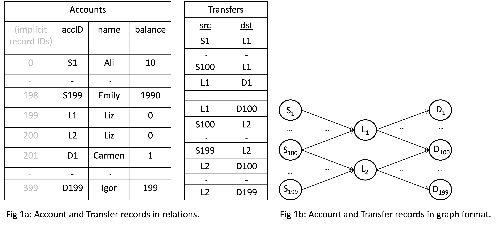
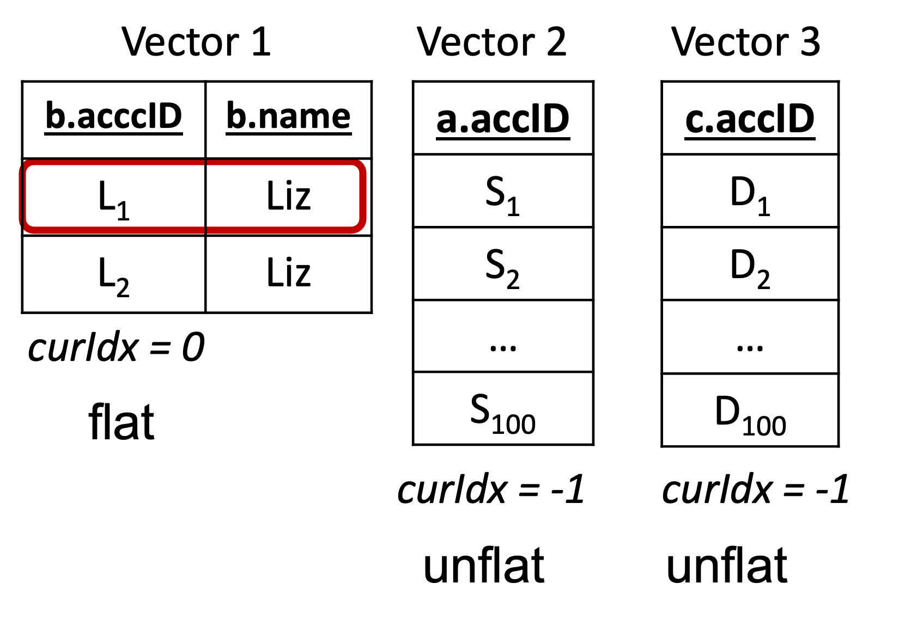

<p align="center">
  
</p>

by Semih Salihoğlu, Jan 23rd, 2023
# Factorization & Great Ideas from Database Theory (Part 1)
Many of the core principles of how to develop DBMSs are well understood.
For example, a very good query compilation paradigm is to 
map high-level queries to a logical plan of relational operators, then optimize this plan,
and then further map it to an executable code often in the form of a physical query plan. 
Similarly, if you want updates to a DBMS to be atomic and durable,
a good paradigm is to use a write-ahead log that serves as a source of truth
and can be used to undo or redo operations. Many systems adopt such common wisdom paradigms. 
As core DBMS researcher, once in a while however, you run into a very simple idea 
that deviates from the norm and is not currently adopted that gets you very excited. 
Today, I want to write about one such idea called [factorization](https://www.cs.ox.ac.uk/dan.olteanu/papers/os-sigrec16.pdf). 

{: .highlight}
> **Tldr: The key takeaways are:**
> - **Overview of Factorization & Why Every GDBMS Must Adopt It**: Factorization
    is a compression technique to compress the intermediate results
    that query processors generate when evaluating many-to-many (m-n) joins. 
    Factorization can compress an intermediate result size exponentially 
    in the number m-n joins in the query.
> - **Example Benefits of Factorization**: Benefits of keeping intermediate
    results smaller reduces the computation processors perform 
    on many queries. Examples include reducing copies by keeping the output
    data size small, reducing filter and expression evaluation computations exponentially,
    and performing very fast aggregations.
> - **How Kùzu Implements Factorization:** Kùzu's query processor
    is designed to achieve 3 design goals: (i) factorize intermediate results;
    (ii) always perform sequential scans of database files; and (iii) avoid
    scanning large chunks of database files when possible. In addition the processor is 
    vectorized as in modern columnar DBMSs. These design goals are achieved by passing 
    multiple *factorized vectors* between each other and using modified HashJoin operators 
    that do *sideways information passing* to avoid scans of entire files.


Factorization is a very
simple data compression technique. Probably all 
compression techniques you know are designed to compress database files that 
are stored on disk. Think of run-length encoding, dictionary compression, or bitpacking.
In contrast, you can't use factorization to compress your raw database files. 
Factorization has a very unique property:
it is designed to compress the intermediate 
data that are generated when query processors of DBMSs evaluate 
many-to-many (m-n) growing joins. If you have read [my previous blog](https://kuzudb.com/blog/what-every-gdbms-should-do-and-vision.html),
efficiently handling m-n joins was one of the items on my list of properties 
that competent GDBMSs should excel in. This is because 
the workloads that GDBMSs commonly handle contain m-n joins
across node records. Each user in a social network or an account in a financial transaction network
or will have thousands of connections and if you want
a GDBMS to find patterns on your graphs, you are 
asking queries with m-n joins. Factorization is directly designed
for these workloads and because of that every competent GDBMS must develop 
a factorized query processor. In fact, if I were to try to write a new analytical RDBMS,
I would probably also integrate factorization into it.

This post forms the 2nd part of my 3-part posts on the contents of our [CIDR paper](https://www.cidrdb.org/cidr2023/papers/p48-jin.pdf)
where we introduced Kùzu. The 3rd piece will be on another technique called worst-case 
optimal join algorithms, which is also designed for a specific class of m-n joins.
Both in this post and the next, I have two goals. First is to try to articulate these techniques 
using a language that is accessible to general software engineers. 
Second, is to make people appreciate the role of 
pen-and-paper theory in advancing the field of DBMSs. Both of these techniques were first 
articulated in a series of purely theoretical papers which gave excellent 
practical advise on how to improve DBMS performance. 
Credit goes to the great theoreticians who pioneered these techniques whom I will cite
in these posts. Their work should be highly appreciated.

## A Quick Background: Traditional Query Processing Using Flat Tuples
Here is a short background on the basics of
query processors before I explain factorization. If you know about 
query plans and how to interpret them,
you can skip to [here](#factorization-in-a-nutshell) after reading
my running example.
Consider a database of Account node and Transfer edge records below.
The two Accounts with `accID` fields L1 and L2 are owned by Liz and 
each have 100 incoming and 100 outgoing Transfer edges.
<p align="center">
  
</p>

Now consider a 2-hop path query in Cypher returning the accID's of source
and destinations of money flows Liz's accounts are facilitating:

```                                              
MATCH (a:Account)-[t1:Transfer]->(b:Account)-[t2:Transfer]->(c:Account)
WHERE b.name = 'Liz' 
RETURN a.accID, c.accID
```

Here's the SQL version of the query if you modeled your records as relations.
Same query different syntax:
```
SELECT a.accID, c.accID
FROM Account a, Transfer t1, Account b, Transfer t2, Account c
WHERE b.name = 'Liz' AND
      t1.src = a.accID AND t1.dst = b.accID
      t2.src = b.accID AND t2.dst = c.accID
```

A standard query plan for this query is shown on the left in Fig. 2. 
The plan contains some Scan operators to scan the raw node or edge records (edges could be 
scanned from a join index) and some hash join operators to perform the joins, and 
a final projection operator.
In some GDBMSs, you might see "linear plans" that look as in Fig. 3.
<table>
  <tr>
    <td></td>
    <td></td>
  <tr>
</table>

The linear plan is from our previous GraphflowDB system. Here
you are seeing an operator called Extend, which joins node records with their Transfer relationships to 
read the system-level IDs of the neighbors of those node records. 
Following the Extend is another Join operator to join the accID properties of those neighbors 
(specifically c.accID and a.accID). 
In Neo4j, you'll instead see an Expand(All) operator, which does the Extend+Join
in GraphflowDB in a single operator[^1]. For very good reasons
we removed these Extend/Expand type operators in Kuzu. I will come back to this.

The interpretation of plans is that tuples are flowing from the bottom to top and
each operator will take in sets of tuples and produce sets of tuples (in a pipelined fashion). 
The key motivation for factorization is that what flows 
between operators are **flat tuples**. When the joins are m-n, this 
leads to many data repetitions, which one way or another leads to repeated
computation in the operators. For example,
the final projection operator in our example would take the table shown in Figure 4 (left).
<p align="center">
  
</p>
There are 20K tuples in the flat representation because both L1 and L2 are part of 
100 incoming x 100 outgoing=10K many 2-paths. Notice the many repetitions in this relation:
L1, L2, or Liz values, or the values in a.accID and c.accID. 
What gets replicated may change across systems. Some may replicate the actual values,
some may replicate indices where these values are stored but overall exactly 20K
tuples would be generated. This redundancy leads to redundant computation here and there
during query processing.

## Factorization In a Nutshell
Factorization addresses exactly this problem. The core reason for the redundancy
is this observation: *given a fixed b value, all a's and c's are conditionally independent*.
More concretely, once b is bound to node L1, each incoming neighbor `a` for L1 will join 
with each outgoing neighbor `c` of L1. If you took the first standard undergraduate course in DBMSs at a university
and you covered the theory of normalization, this is what is 
called a [multi-valued dependency](https://en.wikipedia.org/wiki/Multivalued_dependency)
in relations. Factorization exploits such dependencies to compress
relations using Cartesian products.
Above in Figure 4 (right),
I'm showing the same 20K tuples in a factorized format using only 400 values
(so 2\*(100+100) instead of 2\*100\*100 values). 

That's it! That's the core of the idea! Now of course, this simple observation leads to a ton of 
hard and non-obvious questions that the entire theory on factorization answers. For example, 
given a query, what are the "factorization structures", i.e., the Cartesian product structures
that can be used to compress it? Consider a simple query that counts the number of
paths that are slightly longer:
```
MATCH (a:Account)-[:Wire>(b:Account)-[:Deposit]>(c:Account)-[:ETransfer]->(d:Account)
RETURN count(*)
```
Should you condition on b and factor out 
a's from (c, d)'s or condition on c and factor out (a, b)'s from d's? 
Or you could condition on (b, c) and factor out (a)'s from (d)'s?
To make a choice, a system has to reason about the number of Wire, Deposit,
and ETransfer records in the database.
How much and on which queries can you benefit from factorization?
The theoretical questions are endless. 
The theory of factorization 
develops the formal foundation so that such questions can be answered and  
provides principled first answers to these questions. 
[Dan Olteanu](https://www.ifi.uzh.ch/en/dast/people/Olteanu.html) and his 
colleagues, who lead this field, recently won the [ICDT test of time award](https://databasetheory.org/ICDT/test-of-time)
for their work on factorization. ICDT is one of the two academic venues for theoretical work on DBMSs.

But let's take a step back and appreciate this theory because it gives an excellent 
advise to system developers: *factorize your intermediate
results if your queries contain many-to-many joins!* The great thing
is that this can all be done by static analysis of the query 
during compilation time, without assuming anything about the actual database.
Recall that GDBMSs most commonly evaluate many-to-many joins. So hence my point that 
GDBMSs should develop factorized query processors.


## Examples When Factorization Significantly Benefits:
Factorized intermediate relations can be exponentially smaller
(in terms of the number of joins in the query)
than their flat versions, which 
can yield orders of magnitude speed ups in query performance 
for many different reasons. I will discuss three most obvious ones.

### Less Data Copies/Movement 
The most obvious benefit is that factorization reduces
the amount of data copied between buffers used by operators
during processing and to final `QueryResult` structure
that the application gets access to. 
For example, a very cool feature of Kùzu is that it keeps final outputs in factorized format
in its `QueryResult` class and 
enumerates them one by one only when the user starts calling `QueryResult::getNext()`.
In our running example, throughout processing Kùzu would do copies of
400 data values roughly instead of 20K to produce its `QueryResult`. 
Needless to say, I could have picked a more exaggerated query, say a "star" query
with 6 relationships, and arbitrarily increased the difference in the copies done 
between a flat vs factorized processor.

### Fewer Predicate and Expression Evaluations
Factorization can decrease the amount of predicate or expression executions the system performs.
Suppose we modify our 2-hop query a bit and put two additional filters on the query:
```
MATCH (a:Account)-[e1:Transfer]->(b:Account)-[e2:Transfer]->(c:Account)
WHERE b.name = 'Liz' AND a.balance > b.balance AND c.balance > b.balance
RETURN *
```
A common plan for this version of the query would extend the plan in Figure 1.a above,
with two filter operators: (i) above the second join from the bottom after a and b's are joined,
so the system can run the `a.balance > b.balance` part of the query; (ii) after the last join
 to run the predicate 'c.balance > b.balance'. Suppose the first filter did not eliminate any tuples.
Then, a flat processor would evaluate 20K filter execution in the second filter, simply because there
are 20K tuples and the filter predicate 'c.balance > b.balance` would execute on each tuple.
In a factorized processor, the second filter would run only 200 times because there are only
100 predicates to execute `c.balance > b.balance` once b is matched to Liz. Similarly another 100 predicate
executions would execute on the 2nd factorized tuple that has 0. The same applies to many
other computations DBMSs perform that run general expressions, including the computation
done when performing aggregations, which I will discuss next.

### Aggregations
This is perhaps where factorization yields largest benefits.
One can perform several aggregations directly on factorized tuples using
 algebraic properties of several aggregation functions. Let's
for instance modify our above query to a count(*) query: Find the number of 2-paths' that Liz is 
facilitating. A factorized processor can simply count that there are 100*100 flat tuples in the first
factorized tuple and similarly in the second one to compute that the answer is 20K.
Or consider doing min/max aggregation on factorized variables:
```
MATCH (a:Account)-[e1:Transfer]->(b:Account)-[e2:Transfer]->(c:Account)
WHERE b.accID = 'L1'
RETURN max(a.balance), min(c.balance)
```
I change the predicate on Liz to directly identify L1 so the query is more meaningful. 
This is asking: out of all possible 2-path money flows L1 facilitates, find the one that is
from a source with the highest balance to a destination with the lowest balance (and 
give me the balances). If a processor 
processes the 10K 2-paths in factorized form, then with only 100 comparisons (instead
of 10K), the processor can compute the max and min aggregations. To be more specific,
the aggregation operator would take a single tuple with factorization structure 
{a, a.balance} X (L1) X {b, b.balance} and the tuple would exactly be {(S1, 10),..., (S100,1000)}
X (L1) X {(D1,1),..., (D100,100)}, and the max of the a.balance.could be computed by
inspecting only 100 values (and similarly for min of c.balance).
...

You can try some of these queries on Kuzu and compare its performance on large 
datasets. The benefits of factorizing intermediate results just reduces computation
and data copies here and there in many cases.

### How Does Kuzu Implement A Factorized Query Processor?
Now, continue reading if you are interested in actual database implementations
and want to read about how we implemented factorized query processor in Kuzu.
The rest will be even more technical and forms part of the technical meat of our CIDR paper. 

When designing the query processor of Kuzu, we had 3 design goals: 
1. Factorize intermediate growing join results. 
2. Always perform scans of database files from disk sequentially.
3. When possible avoid scanning entire disk files when possible.

3. requires some motivation, which I will provide below. Let's go one by one.
Factorization: Kuzu has a vectorized query processor, which is the common wisdom
in analytical read-optimized systems. Vectorization, in the context of query processors 
of DBMSs, refers to the design where operators pass a set of tuples, 1024 or 2048, 
between each other during processing.[^3]. Needless to say,
existing vectorized query processors pass a single vector of flat tuples.
Instead, Kuzu operators pass possibly multiple vectors of tuples between each other.
We call each vectors of tuples a "Vector group"
and each vector group can either be flat and represent a single value or unflat.
For example, the first 10K tuples from my running example would be represented
with 3 vector groups as follows:
[Insert Image of 3 vector groups]
This is for example, what would be passed from the last join operator to the projection
in the query plan in [Figure 1a](Check).
The interpretation that what is passed is the Cartesian product of all sets of
tuples in those vectors. Operators know during compilation time how many vector
groups they will take in and how many they will output. Importantly, we still
do vectorization, i.e., each primitive operator operates on a vector of values. 
Credit where credit's due: this was a design that my PhD student 'Amine
Mhedhbi] came up with (with some polishing from me and my Master's student 
Pranjal Gupta) and we directly adopted it in Kuzu.

Ensuring sequential scans: I already told you above that 
Extend/Expand type join operators that lead to non-sequential scans of database files.
These operators are not robust and if you are developing a disk-based system,
non-sequential scans will not scale. That's a mistake. Instead, the more robust (though
not always the most efficient) join operator is to use HashJoins. I'll give a simulation momentarily.

Avoiding full scans of database files. Although I don't like Extend/Expand type join operators,
they come with an advantage. If you had a simple 1-hop query that only asked for:
give me the names of account that Liz has transfered money to. Suppose for simplicity, L1
has made only 3 transfers to accounts with internal recordIDs (106, 5, 75). Then if you had
a linear plan like I showed in [Figure 2a](XXX) check. Then a scan operator can first find
L1's record (and suppose it has internal record ID 7), and using this scan the
those 3 record IDs of L1's neighbors. Then finally, read the name properties 
of 106, 5, 75. Since this is happening in a pipelined fashion, if there were more tuples coming
in to Extend/Expand(All) say L2, with neighbor IDs say 100, 3, 75, the system would again 
scan the names of these 3 neighbors. Note that the scans of the name properties are happening
non-sequentially (more over the same name for node with record ID 75 is being scanned twice)
etc. When a query generates many tuples then the Extend/Expand(All) type operators will degrade.
But on the positive side, they only scan where they have to scan. They don't scan the whole database
file, which is a performance advantage. When designing Kuzu's processor, we wanted 
a mechanism to also avoid scanning only the necessary parts of database files.[^4]
We do this through modified hash join operators that use a technique in DBMSs called 
*sideways information passing*. I'll simulate you a simple computation to put all these 
together.

### A Simple Simulation
For simplicity, we'll work on a simpler 1-hop query, so the benefits of factorization will not 
be as impressive but it will allow me to explain an entire query processing pipeline.
Consider this query:
```
MATCH (a:Account)-[:Transfer]->(b:Account)
WHERE a.accID = L1
RETURN count(*)
```
An annotated query plan we generate is on the right. The figure shows step by step
the computation that will be performed.
[Insert query plan with aggregation]. 
1: The lower Scan operator will scan the accId column and find the recordID of
nodes with accID=Liz. There is only 1 tuple, so only 1 tuple (7, Liz) will be output.
2: This tuple will passed to HashJoin's build side, which will create a hash table from it. 
At this point the processor knows exactly the IDs of nodes, whose Transfer edges need
to be scanned on the probe side: only 7. This is where we do sideways information passing.
Specifically, we pass this "nodeID filter" to the probe side Scan operator.
3. The probe-side scan operator uses the passed node ID filter to only scan
the edges of 7. That is we can only look up where 7's edges are stored and avoid
scanning the entire Transfers database file.
Since Kuzu is a GDBMS, we store the edges of nodes (and their properties) 
in a graph-optimized format called CSR. Importantly, all of the edges of 7 will be 
stored consecutively, so we can output them in factorized format. In my simulation:
(7) X {107, 5, 10}.
4. Next we will probe the (7) X {107, 5, 10} in the built hash table and join
7 with L1: (7, L1) X {107, 5, 10}, which will be passed to the group-by-and-aggregate
operator.
5. The group by operator takes (7, L1) X {107, 5, 10} and counts the number of neighbors of 7 as
3 because the size of {107, 5, 10} is 3.

As you see, in the above simulation, the processing was factorized, we only did sequential scans
but we also avoided scanning the entire Transfer database file, achieving our 3 design goals.
This is a simple example and there are many queries that are more complex and where we 
will want some factorization structure that we cannot achieve with the above operator. For those,
we use yet another join operator (which we currently cal ASPJoin) that is a bit more complex 
but using the same techniques of using: (1) factorized vector groups; (2) hash joins; (3) sideways
information passing. 

So how does it all perform? It's quite well. This type of processing is not always the best but 
there is no technique or optimization in DBMSs that is always the best (you can even
find scenarios where pushing filters down, which is probably the most common
optimization across systems may be slower than not.). But it is very robust. Here's 
an experiment we put on our CIDR paper to give a sense of the behavior of
using modified hash joins and factorization on a micro benchmark query, that
does a 2-hop query with aggregations on every node variable. 
```
XXX
``` 
Needless to say, I'm picking this as it is a simple query that can demonstrate
the benefits of all of the 3 techniques above. Also needless to say, I could have exaggerated with
larger stars or branched tree patterns but this will do.
In the experiment we are changing the selectivity of the predicate on the middle node, which
changes the output size. What we are comparing is the behavior of Kuzu, which integrates
the 3 techniques above with (i) Kuzu-INLJ: A configuration of Kuzu that uses factorization but instead of
our modified HashJoins uses an Extend-like operator. The INLJ stands for
"index nested loop join", which is the name given to the style of joins Extend-like operators perform;
and (ii) Umbra, which represents the
state of the art RDBMS. Umbra is as fast as existing RDBMSs get. It probably integrates
every known low-level performance technique in the field. You can read all about it in these publications
if you are interested [1](XXX), [2](XXX), [3](XXX)[^5]. 
Umbra however does not 
do factorization or have a mechanism to avoid scanning entire database files, so we
expect it to perform poorly on the above query. Here's a performance table.

So when the selectivity is very low, Extend-like operators + factorization do quite well
because they don't yet suffer much from non-sequential scans and they avoid several overheads
of hash joins: no hash table creation and no semijoin filter mask creation. But they are not robust
and they degrade quickly. We can also see that even if you're Umbra, without factorization
or a mechanism to avoid scanning entire files, you will not perform very well on these
many-to-many queries. 

## Final marks: 
I am fully convinced that modern GDBMSs have to be factorized systems to remain 
competitive in performance. If your system assumes that most joins will be growing,
then this is the only known technique whose principles are relatively well understood
that one can go and implement it. I am sure different factorized query processors will
be proposed as more people attempt at it. I was happy to see in CIDR that at least 2 systems
gurus told me they want to integrate factorization into their systems. 
If your query requires performing m growing joins and you have IN number 
of database tuples,  factorization can compress an intermediate result size of IN^{m-1}
to IN. When you see a technique with such polynomial reduction benefits, it is a good sign
that for many queries it can make the difference between a system timing out vs providing 
an actual answer. 
 
Finally  there is much more on the theory of factorization, which I did not cover. From my side, 
most interestingly, there 
are even more compressed ways to represent the intermediate results than the 
vanilla Cartesian product scheme I covered in this post. Just to raise a curiosity, it's called 
[d-representations] but that will have to wait for another time. For now, let me finish by
saying that I hope you appreciate the benefits of factorization and the role of theory in advancing
the state-of-the-art in DBMSs. Thanks for reading!


Footnotes
[^1]: If you come from a very graph-focused background and/or exposed to a ton of 
GDBMS marketing, you might react to my statement that what I am showing are standard plans
that do joins. Maybe you expected to see graph-specific operators, such as
a BFS or a DFS operator because the data is a graph. Or maybe someone even dared to tell you that
GDBMSs don't do joins but they do traversals. Stuff like that. These word tricks
and confusing jargon really has to stop and helps no one. If joins are in the nature of the computation 
you are asking a DBMSs to do,  calling it something else won't change the nature of the 
computation. Joins are joins. Every DBMSs needs to join their records with each other.

[^2]: You can take a look at [our CIDR paper on Kuzu](XXX) and
[this GRainDB work](XXX) to see experiments and in-depth discussion of 
why Extend/Expand-type operators are not robust operators and perform very poorly in many settings.

[^3]: Vectorization emerged as a design in the context of columnar RDBMSs, 
which are analytical systems, about 15-20 years old. It is still a very good idea. The prior
design was to pass a single tuple between operators, which is quite easy to implement,
but quite inefficient on modern CPUs. You can read all about it from the pioneers 
of [columnar RDBMSs](XXX).

[^4]: Note that GDBMSs are able to avoid scans of entire files because notice that they do the join
on internal record IDs, which mean something very specific. If a system needs to scan the name
property of node with ID 75, it can often arithmetically compute the disk page and offset where
this is stored, because node IDs are dense (i.e., start from 0, 1, 2...) and so can serve as 
pointers if the systems storage design exploits this. This is what I was referring to as
"Predefined/pointer-based joins", which is a good advantage for GDBMS to efficiently
evaluate the joins of node records that are happening along the "predefined" edges in the database.
I don't know of a mechanism RDBMSs, where joins are value-based, can do something similar,
unless they develop a mechanism to convert value-based joins to pointer-based joins. See my
student [Guodong's work last year in VLDB] of how this can be done. 

[^5]: Umbra is being developed by [Thomas Neumann](XXX) and his group. 
If Thomas's name does not ring a bell let me explain his weight in the field like this. As the
joke goes, in the field of DBMSs: there are gods at the top, then there is Thomas Neumann, 
and then other holy people, and then we mere mortals. 

